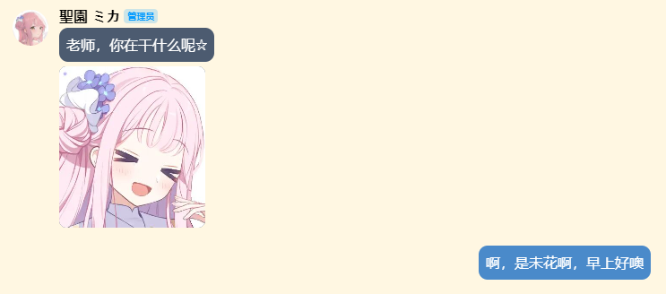
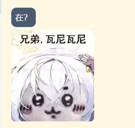

# MomoTalkNTQQ-Theme

[LiteLoaderQQNT](https://github.com/mo-jinran/LiteLoaderQQNT) 插件，基于 [LiteLoaderQQNT-Telegram-Theme](https://github.com/festoney8/LiteLoaderQQNT-Telegram-Theme/tree/v4) 低质量修改，低仿 Momotalk 风格的QQNT主题

这是一个低创主题，欢迎各位fork或者提交pr，谢谢你。

dark主题不适配，因为momotalk没有dark主题。

如果侵犯到原主题的版权的，我会删除的！

↓以下README只对目录名和功能进行了更改，其他都是[LiteLoaderQQNT-Telegram-Theme](https://github.com/festoney8/LiteLoaderQQNT-Telegram-Theme/tree/v4) 编写的↓

## 介绍

-   低仿 Momotalk
-   支持自定义壁纸
-   支持日间模式、夜间模式不支持
-   Momotalk 风格气泡 (没有小尖尖)
-   支持连续消息合并
-   支持自定义主题样式，提供大量设置项

## 版本适配

-   仅适配 **LiteLoaderQQNT 1.0.0** 及以上版本

## ⚠已知问题⚠

1. 私聊头像无法显示（实际上是不会改）

2. 会话选择框其中的文字颜色只能是白色（还是不会改qwq）

应该还有更多吧……

## 使用方法

1.  从 [Release](https://github.com/MiyakoLol/MomoTalkNTQQ-Theme/releases) 下载 zip 压缩包（或直接 clone 项目）

2.  将主题文件解压到 LiteLoaderQQNT 数据目录的 `plugins` 文件夹下

3.  重启 QQ

> [!CAUTION]
>
> -   **注意：切换 日间/夜间模式 时，主题会自动适配，但设置页不会更新。需重新打开设置页，再修改主题设置**
> -   **Momotalk 没有夜间主题！请不要切换成夜间模式！（↑为原作者制作的作品问题）**

## 兼容性

-   **请不要与其他 LiteLoader 主题同时使用**

-   **本主题自带「头像置底、头像浮动、连续消息合并」，若同时使用 [轻量工具箱](https://github.com/xiyuesaves/LiteLoaderQQNT-lite_tools)，请关闭工具箱的这三项功能**

-   本主题自带「自定义壁纸」功能，不必与其他插件的自定义壁纸同时启用

## 其他

-   本项目纯娱乐用途，仅供学习交流，请勿在微信、QQ、B 站之类的平台传播
-   没学过 Electron，代码菜，能跑就行，能跑的代码都是 GPT 写的，bug 都是我写的（
